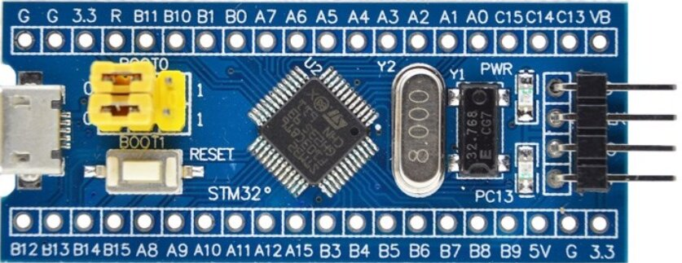
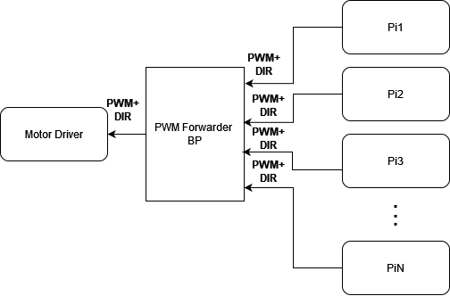
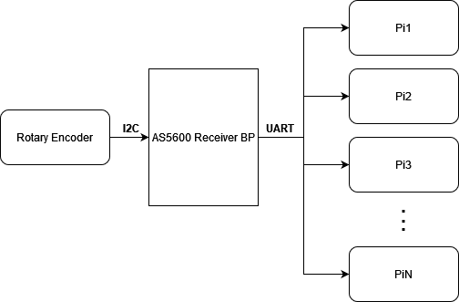

# Inverted Pendulum Firmware

### Microcontroller Firmware

The microcontroller chosen for this project was the STM32F103C, commonly use as part of the dev board known as the Bluepill:

<!--  -->
<p align="center">
  
</p>

To allow the Raspberry Pi nodes for the Inverted Pendulum to act as replicas in a distributed system, we did not want to have leader nodes. In order to actuate the motor for the pendulum, we need a single input to a motor driver circuit in the form of a PWM signal. So, we elected to use an intermediate microcontroller which is responsible for receiving the output in the form of a PWM signal from all of the Raspberry Pi nodes, and then output a final PWM signal to the motor driver.

<p align="center">
  
</p>
<!--  -->

A second Bluepill is used to distribute the rotary encoder output to the Raspberry Pi nodes. This Bluepill acts as an I2C master to the AS5600 I2C minion rotary encoder. The received angle is then sent to the raspberry pi nodes over UART as the Raspberry Pi 4B used for this project does not have the necessary hardware to be used as an I2C minion. 

<p align="center">
  
</p>
<!--  -->

For ease of development and flashing, we elected to use PlatformIO with the Arduino framework for the firmware on the microcontrollers. PlatformIO is an open-source ecosystem for embedded development that provides a unified development platform for multiple microcontroller architecture. If you use VSCode, you can install the [PlatformIO extension](https://marketplace.visualstudio.com/items?itemName=platformio.platformio-ide). Otherwise, please install the CLI version, following these instructions:

[https://docs.platformio.org/en/latest/core/installation/index.html](https://docs.platformio.org/en/latest/core/installation/index.html).

The following instructions outline how to flash the Bluepill microcontrollers assuming that you are using the CLI:

Connect to the PWM forwarder Bluepill using an ST-Link V2 programmer. Navigate to ‘BluepillFirmware/PWMForwarder’ in your terminal and run:

```bash
pio run --target upload
```

If flashing is successful and there is no PWM output any connected Pis, the digital display connected to the PWM Forwarder will display “”.

Now, you can connect the ST-Link to the AS5600 Bluepill, navigate to the ‘BluepillFirmware/AS5600ReceiverBP’ folder and run

```bash
pio run --target upload
```

If flashing is successful, and the connection to the sensor is live, then the connected digital display will read “Hello World”.