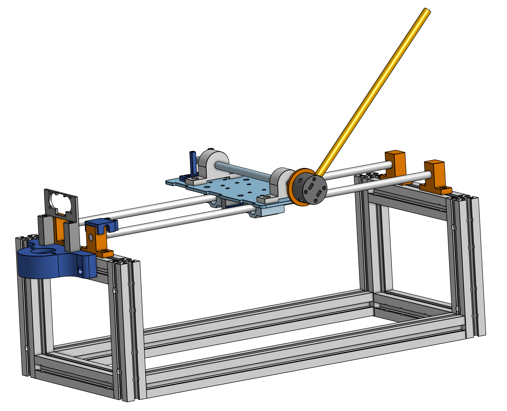

# Inverted Pendulum Mechanical Design and Build Notes

## Components Used

********Basic components such as nuts, bolts, washers and spacers are not included********

### Pendulum Frame

| Item | Quantity | Link | Specifications |
| --- | --- | --- | --- |
| T-Slot Nuts | 32 | https://www.mcmaster.com/products/t-slot-nuts/t-slotted-framing-fasteners-4/system-of-measurement~metric/rail-height~20mm/ | Single Nut, 20 mm single rail height |
| Corner Brackets | 8 | https://www.mcmaster.com/products/corner-brackets/t-slotted-framing-structural-brackets/ | 20 mm rail height |
| Aluminum T-Slot Framing Rails | 8 | https://www.mcmaster.com/products/aluminum-extrusions/rail-profile~single/single-rail-profile-style~four-slot/system-of-measurement~metric/rail-height~20mm/rail-width~20-mm/ | 0.5ft length, 20 mm rail height |
| Aluminum T-Slot Framing Rails | 2 | https://www.mcmaster.com/products/aluminum-extrusions/rail-profile~single/single-rail-profile-style~four-slot/system-of-measurement~metric/rail-height~20mm/rail-width~20-mm/ | 1.5 ft length, 20 mm rail height |

### Linear Motion System

| Item | Quantity | Link | Specifications |
| --- | --- | --- | --- |
| Linear Motion Shaft | 2 | https://www.mcmaster.com/products/linear-shafts/linear-motion-shafts-5/system-of-measurement~metric/diameter~8mm/length~600-mm/ | Shaft Length: 8 mm, Shaft Diameter: 600 mm |
| Shaft Collars | 4 | https://www.amazon.ca/Aluminum-Linear-Support-Motion-Diameter/dp/B08JTPG54L/ref=sr_1_2?crid=1XF4PQXC0K5AQ&keywords=8+mm+shaft+support&qid=1696446692&sprefix=8mm+shaft+suppor,aps,131&sr=8-2 | Bore Diameter: 8 mm  |
| Linear Ball Bearings | 2 |  | Bore Diameter: 8 mm |
| GT2 Idler | 1 | https://a.co/d/6dsKSIS | Tooth Profile: GT2 |
| GT2 Motor Mounted Pulley | 1 | https://a.co/d/6dsKSIS | Tooth Profile: GT2, Bore Diameter:  |
| Timing Belt | 1 | https://a.co/d/6dsKSIS | Tooth Profile: GT2, Bore Diameter:  |
| Clamp Mount Block | 1 | https://a.co/d/6dsKSIS | Tooth Profile: GT2 |
| Motor Mount | 1 | 3D Print STL: [`Motor_Mount.stl`](Motor_Mount.stl) | Material: PLA, Dimensions: |
| Cart Timing Belt Mount | 1 | 3D Print STL: [Cart_Timing_Belt_Mount.stl](Cart_Timing_Belt_Mount.stl) | Material: PLA, Dimensions: |
| Idler Mount | 1 | 3D Print STL: [`Idler_Mount.stl`](Idler_Mount.stl)  | Material: PLA, Dimensions: |
| Motor Driver Mount | 1 | Laser Cutter DXF: [`Motor_Driver_Mount.stl`](Motor_Driver_Mount.stl) | Material: MDF, Dimensions: |

### **Pendulum Shaft System**

| Item | Quantity | Link | Specifications |
| --- | --- | --- | --- |
| Pendulum to Rotary Shaft Mount | 1 | 3D Print STL: [`Pendulum_To_Rotary_Shaft_Mount.stl`](Pendulum_To_Rotary_Shaft_Mount.stl) | Material: PLA, Dimensions:  |
| Rotary Shaft Flange | 1 | https://a.co/d/g265dLN | Bore Diameter: 10 mm |
| Rotary Mounted Bearings | 1 | https://a.co/d/airvwwv | Bore Diameter: 10 mm |
| Rotary Shaft | 1 | https://www.mcmaster.com/products/rotary-shafts/rotary-shafts-5/system-of-measurement~metric/ | Diameter: 10 mm, Length: 200 mm, Material: 1566 Carbon Steel |
| AS5600 Mount | 1 | 3D Print STL: [`AS5600_Mount.stl`](AS5600_Mount.stl) | Material: PLA, Dimensions:  |
| Pendulum Cart | 1 | Laser Cutter DXF: [`Pendulum_Cart.dxf`](Pendulum_Cart.dxf) | Material: MDF, Dimensions |
|  |  |  |  |

### **Sensor Mounts**

| Item | Quantity | Link | Specifications |
| --- | --- | --- | --- |
| Motor-Side Ultrasonic Mount | 1 | 3D Print STL: [`Ultrasonic_Mount.stl`](Ultrasonic_Mount.stl) | Material: PLA, Dimensions: |
| Idler-Side Ultrasonic Mount | 1 | 3D Print STL: [`TODO`]() | Material: PLA, Dimensions: |
| Limit Switch Mount | 1 | 3D Print STL: [`Limit_Switch_Mount.stl`](Limit_Switch_Mount.stl) | Material: PLA, Dimensions: |
| Ultrasonic Reflection Surface | 1 | Laser Cutter DXF: [`TODO`]() | Material: Cardboard, Dimensions: |

### CAD Files

**Full Assembly**

[Onshape](https://cad.onshape.com/documents/4bf8413ba8de0c065cd15fe9/w/5f5a90b8a1e2c8779d00a033/e/c47179ad8bca38d01a648ef1?renderMode=0&uiState=651dc1b5710949032425fcc0)

### Mechanical Build Notes

- Alignment of the linear motion system is a key consideration during construction. Assembly should be completed on a strong, stable and level surface. Movement of the cart along linear motion rails should not cause binding towards the ends of the track, so adjust shaft collar positions along the t-slots as required for smooth motion and aligned linear motion shafts. Smooth motion of this system is important as jolts/jerkiness of the system causes unneeded difficulty in control of the unstable system and misalignments causes reliability concerns.
- Timing Belt should be under appropriate tension, you should be able to “strum” it, like a tight guitar string and it should not hang slack. Tension should be comparable to 3D printer timing belts.
- With the cart in constant motion with changing directions and vibrations in the system, it’s advisable to tighten bolts and add a second locking bolt. Alternatively, components such as loc-tite or locking nuts can be used to reduce the likelihood of vibrations causing nuts to fall.
- The linked aluminium extrusions available on McMaster-Carr have a non-standard footprint (i.e. not the commonly available 80x20 footprint). I would recommend using 8020 extrusions instead as it is easier to find parts to work with these extrusions (i.e. corner gussets, slot nuts, etc.) as you are not limited by what is available on McMaster-Carr. This may also result in a cheaper build.