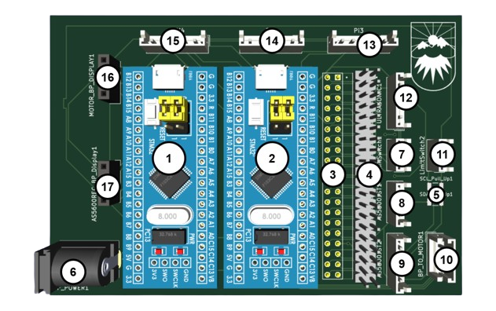
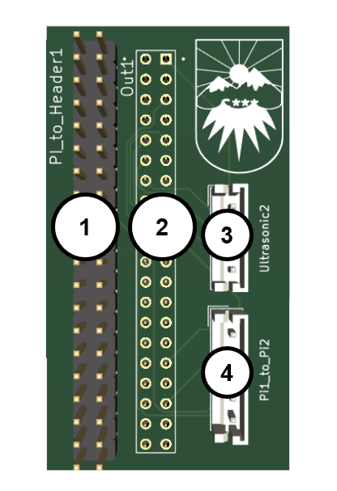
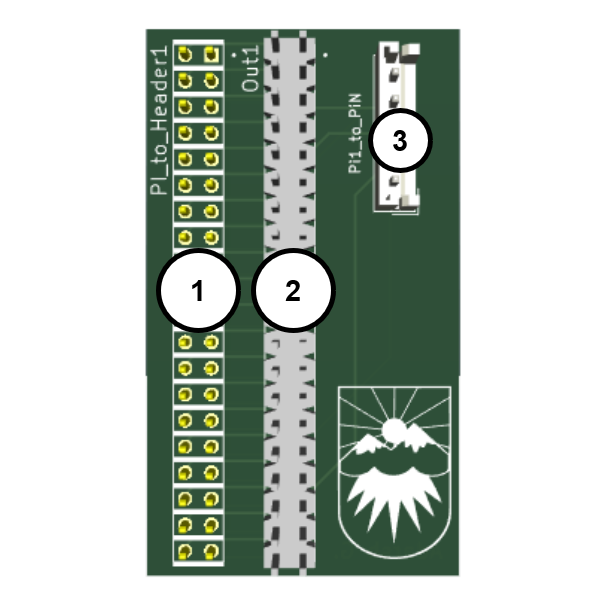

# Inverted Pendulum Electrical Documentation and PCB Designs

## Components/Sensors Used

| Component | Quantity | Purchase Link | Notes |
| --- | --- | --- | --- |
| Ultrasonic Sensor | 2 | https://www.digikey.ca/short/wqjn48db |  |
| AS5600 Rotary Encoder | 1 | https://a.co/d/2jkT8j0 | Prebuilt breakout board with magnet included used |
| Brushed DC Motor | 1 | https://a.co/d/41Gn3cl | Any smooth motion motor with low cogging and similar specifications is usable. |
| Raspberry Pi 4B | 4 | -  | - |
| Bluepill (STM32F103C dev board) | 2 | https://a.co/d/aVWNCsf |  |
| ST-Link V2 | 1 | https://a.co/d/aVWNCsf |  |
| 12 V Motor Driver | 1 | https://www.cytron.io/p-10amp-5v-30v-dc-motor-driver |  |
| 12 V Power Supply | 1 | https://www.digikey.ca/short/t58bfrvt |  |
|  4.7 kOhm Resistor | 2 | https://www.digikey.ca/short/v238crf2 | For I2C Lines |
| JST Connector Set | 1 | https://a.co/d/0fB4Xf2 |  |
| I2C OLED Display Module | 2 | https://a.co/d/eMWrLmH |  |
| Header Pins (Male) | 8 | https://www.digikey.ca/short/54wwz4hv |  |
| Header Pins (Female) | 4 | https://www.digikey.ca/short/5cdf2dd4 |  |
| Custom PCBs | 4 | Download design files and manufacture at any PCB fab. | Details included below in PCB Design Section |
| PJ002A Connector | 1 | https://www.digikey.ca/short/v80h319m |  |
| AC DC Wall Power Adapter, Barrel Jack | 1 | https://www.digikey.ca/short/rw25c3v4 |  |
| Limit Switch | 2 | https://www.digikey.ca/short/8dmrj95d |  |

## PCB Design

In testing and integration of the system, I found that wiring using Dupont (jumper) wires to connect to the Pi headers was not a suitable long term solution as sensors would come unplugged and connections were unreliable. 

I elected to instead design a few custom Pi Hat PCBs that could plug into the Raspberry Pi 4Bs GPIO Headers. These PCBs included JST connectors for more permanent connections to sensors and allowed for cleaner, reliable wiring. To keep connections clean, zip ties and cable tie mounts were used to bundle and route wires.

Below are descriptions for the KiCad projects used to manufacture the PCBs for the project, as well as labelled diagrams of the PCB for an end user.

### **PCB Files**

Pi Hat (`Pi1_PiHat`):

This is the Pi Hat for the “main” Raspberry Pi. In a single node setup, this PCB alone with 1 Raspberry PI is sufficient. 

  

<!--  -->

| Number | Label | Description |
| --- | --- | --- |
| 1 | AS5600 Distributor Bluepill | BP responsible for receiving AS5600 communication over I2C and sending this over UART to all connected Pis |
| 2 | PWM Forwarder Bluepill | BP responsible for receiving the PWM signal from all Pi’s and sending the final output PWM signal to the motor |
| 3 | Board to Pi Header | Connects to 40 pin Pi Header |
| 4 | Pi Header Extension | Allows access to all Pi Header pins |
| 5 | I2C Pullup Resistors |  |
| 6 | Barrel Jack (PJ002A) | 3V3 Power Input for Bluepills |
| 7 | Limit Switch 1 Connector | Limit switch input, allows detection for when cart is at rails of the physical track |
| 8 | AS5600 Connector 1 | Connector for I2C comms, direction signal and programming pins of AS5600 |
| 9 | AS5600 Connector 2 | Connector for power, ground and analog output of AS5600 |
| 10 | BP to Motor Connector | Connection to share ground, send direction and PWM to the motor driver |
| 11 | Limit Switch 2 Connector | Limit switch input, allows detection for when cart is at rails of the physical track |
| 12 | Ultrasonic 1 Connector |  |
| 13 | Pi1 to Pi3 Connector | Connects ground, AS5600 Distributor BP UART Tx line, limit switches and motor instruction lines |
| 14 | Pi1 to Pi2 Connector | Connects ground, AS5600 Distributor BP UART Tx line, limit switches and motor instruction lines |
| 15 | Pi1 to Pi4 Connector | Connects ground, AS5600 Distributor BP UART Tx line, limit switches and motor instruction lines |
| 16 | PWM Forwarder BP to Display Connector | Connector for BP to digital display |
| 17 | AS5600 Distributor BP to Display Connector | Connector for BP to digital display |

Pi Hat 2 (`Pi2_PiHat`):

This is the Pi Hat for the secondary node for a simple two node setup. The second node has a connector to the “main” Pi Hat as well as an additional Ultrasonic sensor.

  

| Number | Label | Description |
| --- | --- | --- |
| 1 | Board to Pi Header | Connects to 40 pin Pi Header |
| 2 | Pi Header Extension | Allows access to all Pi Header pins |
| 3 | Ultrasonic 2 Connector |  |
| 4 | Pi1 to Pi2 Connector | Connects ground, AS5600 Distributor BP UART Tx line, limit switches and motor instruction lines |

Pi Hat N (`PiN_PiHat`):

  

| Number | Label | Description |
| --- | --- | --- |
| 1 | Board to Pi Header | Connects to 40 pin Pi Header |
| 2 | Pi Header Extension | Allows access to all Pi Header pins |
| 4 | Pi1 to PiN Connector | Connects ground, AS5600 Distributor BP UART Tx line, limit switches and motor instruction lines |

This is the Pi Hat for all additional nodes. It includes a connector to the main Pi Hat to share ground, a UART line, limit switch input, and outputs to the motor driving Bluepill.