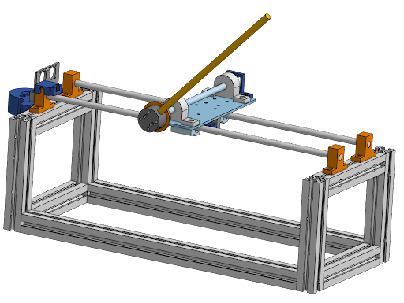
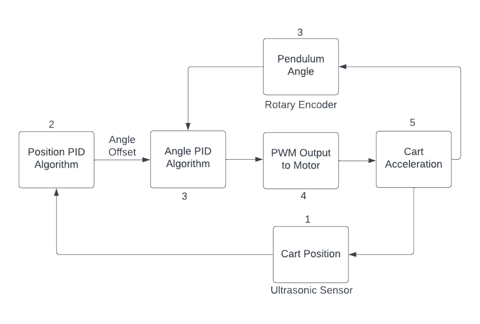
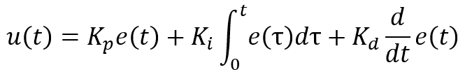
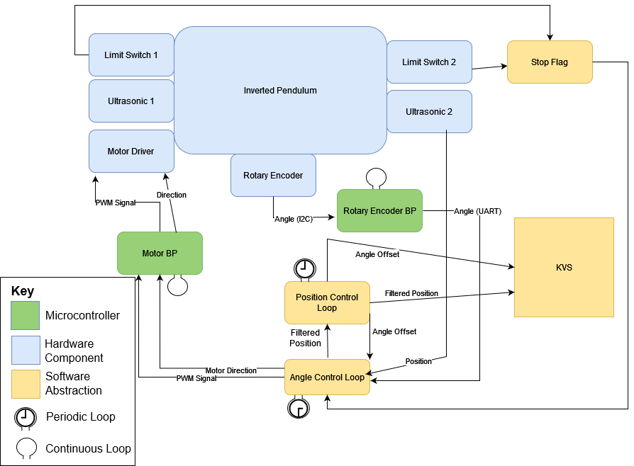
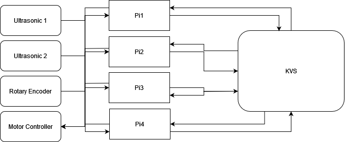

<!-- # IVP System Guide -->

This repository contains source code and build documentation for a physical inverted pendulum test platform. The physical system, seen below, works to keep the pendulum shaft upright by actuating a pendulum cart along a track. To achieve this, we use a PID controller program that runs on a network of 4 Raspberry Pis. The Pis are able to communicate with each other using a distributed key value store. 

<p align = "center">
  
</p>

## Controls

### PID Control
<p align="center">
  
</p>

PID Control is used to actuate system and balance the pendulum. There are 2 PID algorithms running at different sampling rates (30 Hz for Position PID and 200 Hz for Angle PID were lower bounds in our testing). 

The PID algorithm tracks the error of a system over time and applies the following computation to it:

$$
  u(t)=K_pe(t)+ K_i \int_{a}^{b} e(\tau) \,d\tau + K_d \frac{d}{dt} e(t)
$$
<!-- <p align="center">
  
</p> -->
<!--  -->

The proportional term of $K_pe(t)$ can be thought of as **reacting immediately to the current error**, the integralterm as **accumulating past errors over time**, and the derivative as **predicting future error trends**. PID control offers a cost-effective and straightforward solution compared to more complex control methods. 

The position PID algorithm takes the Cart Position as an input. This is given by an ultrasonic sensors on the sides of the assembly, then filtered before being passed as an input. The position PID algorithm then computes an output which we call an Angle Offset. This is an offset to the real angle of the pendulum and works to amplify the response of the angle controller when the cart nears the edges of the track. Without this controller, the pendulum has no incentive to remain with the bounds of the track.

The angle controller takes the current angle of the pendulum along with the offset provided by the position controller and computes the appropriate signal to send to the motor accordingly. A larger deviation from the desired angle results in more force applied by the motor to correct the pendulum.

## System Overview

### Starting with a Single Node Setup



A diagram for the system for a single node configuration is seen above.  

The physical build consists of the pendulum itself, with a Rotary Encoder, 2 Ultrasonic sensors, 2 limit switches and a motor driver. 

In order to control the pendulum we periodically drive the motor on the pendulum using a PWM signal, which is scaled and given direction based on the state of the system, using the PID scheme outlined above.

The single node in the setup is running 2 periodic tasks at different periods, a **Position Control Loop** and an **Angle Control Loop**. At the Position Control Loop we read a filtered position of the cart and use this as input to the Position PID algorithm. The output is saved to our Key Value Store and is shared with the Angle Control Loop through a shared memory location. 

The **Rotary Encoder BP** is a microcontroller running a continuous loop which reads the **Rotary Encoder** to find the current angle of the pendulum in every loop and forwards this value to the **Angle Control Loop**. The **Angle Control Loop** also receives a reading for the cart's current position along the track from **Ultrasonic 1**. 

 The **Angle Control Loop** performs some filtering of the position and shared this back to the Position Control Loop through a shared memory location. The **Angle Control Loop** uses the output of the position control loop for the angle PID algorithm to give us the output to the Pendulum. This output is in the form a scalar value that is then translated to the duty cycle and direction of a PWM signal.

The **Motor BP** is another microcontroller that is running a continuous loop where it receives the PWM signal from the **Angle Control Loop** and forwards it to the motor driver which then actuates the actual pendulum to achieve control. 

### Moving to a Multi Node Setup

<p align="center">
  
</p>
<!--  -->

In a Multi Node Setup,, we have a maximum of 4 Raspberry Pi Nodes. Each of these is running an **Angle Control Loop** and a **Position Control Loop**. 2 Pis are capable of receiving position values from an independent Ultrasonic Sensor, and all 4 Pis are capable of receiving angular values from the **Rotary Encoder BP**. 

Position values can be shared across the Pis using the KVS, along with the control output from each Pi, along with any other values.

Each Pi computes its own control output, comprised of the PWM and Direction signals which are sent to the **Motor BP**. The **Motor BP** is then responsible for deciding on the output to send to the **Motor Driver**, which actuates the cart along the pendulum platform.

## Running on Raspberry Pis

We assume the following:
  - 4 raspberry pi nodes with hostnames `achal01-achal04`
  - nodes can access each other via SSH without passwords
  - this repository is cloned in the home directory of each node
  - PTP is installed
  
### PTP and VLAN config

Run `ifconfig`, expected output:

    eth0: flags=4163<UP,BROADCAST,RUNNING,MULTICAST>  mtu 1500
            inet 198.162.55.144  netmask 255.255.254.0  broadcast 198.162.55.255
            inet6 fe80::3a6:5deb:2c59:cd7f  prefixlen 64  scopeid 0x20<link>
            ether dc:a6:32:cd:ce:77  txqueuelen 1000  (Ethernet)
            RX packets 130046388  bytes 273546776 (260.8 MiB)
            RX errors 0  dropped 0  overruns 0  frame 0
            TX packets 131685298  bytes 406542628 (387.7 MiB)
            TX errors 0  dropped 0 overruns 0  carrier 0  collisions 0

    lo: flags=73<UP,LOOPBACK,RUNNING>  mtu 65536
            inet 127.0.0.1  netmask 255.0.0.0
            inet6 ::1  prefixlen 128  scopeid 0x10<host>
            loop  txqueuelen 1000  (Local Loopback)
            RX packets 76902811  bytes 8946060175 (8.3 GiB)
            RX errors 0  dropped 0  overruns 0  frame 0
            TX packets 76902811  bytes 8946060175 (8.3 GiB)
            TX errors 0  dropped 0 overruns 0  carrier 0  collisions 0

Run the following commands:
  ```bash
    sudo ip link add link eth0 name eth0.11 type vlan id 1 egress 0:2 1:2 2:2 3:2 4:2 5:2 6:2 7:2
    sudo ip link add link eth0 name eth0.12 type vlan id 2 egress 0:4 1:4 2:4 3:4 4:4 5:4 6:4 7:4
  ```
Again run `ifconfig`, expected output:
```
eth0: flags=4163<UP,BROADCAST,RUNNING,MULTICAST>  mtu 1500
        inet 198.162.55.144  netmask 255.255.254.0  broadcast 198.162.55.255
        inet6 fe80::3a6:5deb:2c59:cd7f  prefixlen 64  scopeid 0x20<link>
        ether dc:a6:32:cd:ce:77  txqueuelen 1000  (Ethernet)
        RX packets 130046461  bytes 273556620 (260.8 MiB)
        RX errors 0  dropped 0  overruns 0  frame 0
        TX packets 131685371  bytes 406551468 (387.7 MiB)
        TX errors 0  dropped 0 overruns 0  carrier 0  collisions 0

eth0.11: flags=4163<UP,BROADCAST,RUNNING,MULTICAST>  mtu 1500
        inet6 fe80::6584:daac:a387:87c4  prefixlen 64  scopeid 0x20<link>
        ether dc:a6:32:cd:ce:77  txqueuelen 1000  (Ethernet)
        RX packets 0  bytes 0 (0.0 B)
        RX errors 0  dropped 0  overruns 0  frame 0
        TX packets 4  bytes 686 (686.0 B)
        TX errors 0  dropped 0 overruns 0  carrier 0  collisions 0

eth0.12: flags=4163<UP,BROADCAST,RUNNING,MULTICAST>  mtu 1500
        inet6 fe80::824d:a435:2f9b:ca3a  prefixlen 64  scopeid 0x20<link>
        ether dc:a6:32:cd:ce:77  txqueuelen 1000  (Ethernet)
        RX packets 0  bytes 0 (0.0 B)
        RX errors 0  dropped 0  overruns 0  frame 0
        TX packets 7  bytes 976 (976.0 B)
        TX errors 0  dropped 0 overruns 0  carrier 0  collisions 0

lo: flags=73<UP,LOOPBACK,RUNNING>  mtu 65536
        inet 127.0.0.1  netmask 255.0.0.0
        inet6 ::1  prefixlen 128  scopeid 0x10<host>
        loop  txqueuelen 1000  (Local Loopback)
        RX packets 76902811  bytes 8946060175 (8.3 GiB)
        RX errors 0  dropped 0  overruns 0  frame 0
        TX packets 76902811  bytes 8946060175 (8.3 GiB)
        TX errors 0  dropped 0 overruns 0  carrier 0  collisions 0
```
Check the PTP status using systemctl status ptp4l and find the path of the ptp4l service

For example, the output will contain a line `Loaded: loaded ( ; enabled; vendor preset: enabled)`

Open file using  `sudo vim /lib/systemd/system/ptp4l.service` and check the ethernet interface used by PTP

By default, it is `eth0`, replace it with `eth0.11`

Run the following systemctl commands:
  ```bash
  sudo systemctl daemon-reload
  sudo systemctl restart ptp4l
  ```

### Running the Pendulum
<!-- 1. Run [`setup.sh`](http://setup.sh) on each Pi -->
1. Naviagate to this repository on Pi 1
2. Build the project:
    1. Navigate to the `build` directory
    2. run `cmake ..`
    3. run `make`
3. Enable UART on each of the Pis from the `raspi config` tool.
4. Callibrate pendulum by running the following command in the build directory of any of the connected Pis:
    ``` bash
    sudo ./test_AS5600
    ```
    This displays the rotary encoder angle, balance the pendulum manually and note the encoder value shown in the terminal. Ideally, this should be 2000 plus or minus 300, to keep the rollover state for angle outside the operating range of the pendulum.

5. Run the pendulum application from the project directory:

    ```bash
    sudo ./pivp_run.sh $NUM_NODES $POSITION_LOOP_PERIOD $ANGLE_LOOP_PERIOD $POSITION_KP $POSITION_KD $POSITION_KI $ANGLE_KP $ANGLE_KD $ANGLE_KI $POSITION_SET_POINT $ANGLE_SET_POINT
    ```

      Values that worked well for our system for the other parameters:

      | Parameter | Value |
      |--- | --- |
      |`NUM_NODES`| number of nodes you are running with| 
      | `POSITION_LOOP_PERIOD`: | 20 |
      | `ANGLE_LOOP_PERIOD`: | 6 |
      | `POSITION_KP`: | 0.01 |
      | `POSITION_KD`: | 0.08 |
      | `POSITION_KI`: | 0 |
      | `ANGLE_KP`: | 25 |
      | `ANGLE_KD`: | 2.5 |
      | `ANGLE_KI`: | 150 |
      | `POSITION_SET_POINT`: | 20 - Corresponds to distance from side to middle of track in cm |
      | `ANGLE_SET_POINT`: | calibration value from previous step |

6. Press either limit switch on sides of pendulum track to stop a run of the pendulum
7. Logs for the run are available at local nodes at ‘PiCtlLogs/date-of-runcompletion_time-of-completion_PiN’

## Pendulum Build Documentation
Detailled descriptions of how to build the pendulum and various aspects of the systemn are included in subdirectories of this project.
- [`Bluepill_Firmware`](Bluepill_Firmware): Firmware for 2 Bluepill microcontrollers used, along with instructions for how to flash the firmware on the devices.
- [`PCB_Designs_Docs`](PCB_Designs_Docs): All PCB design files for the custom PCBs used in the pendulum, including labelled circuit diagrams for reference, gerber and drill files for fabrication. Additionally, all electrical components and quantities, with purchase links are shown. 
- [`Mech_Docs`](Mech_Docs): All mechanical components with purchase links and quantities are included. Additionally, CAD design files, STL files for 3D printed parts and DXFs for laser cut parts are included.